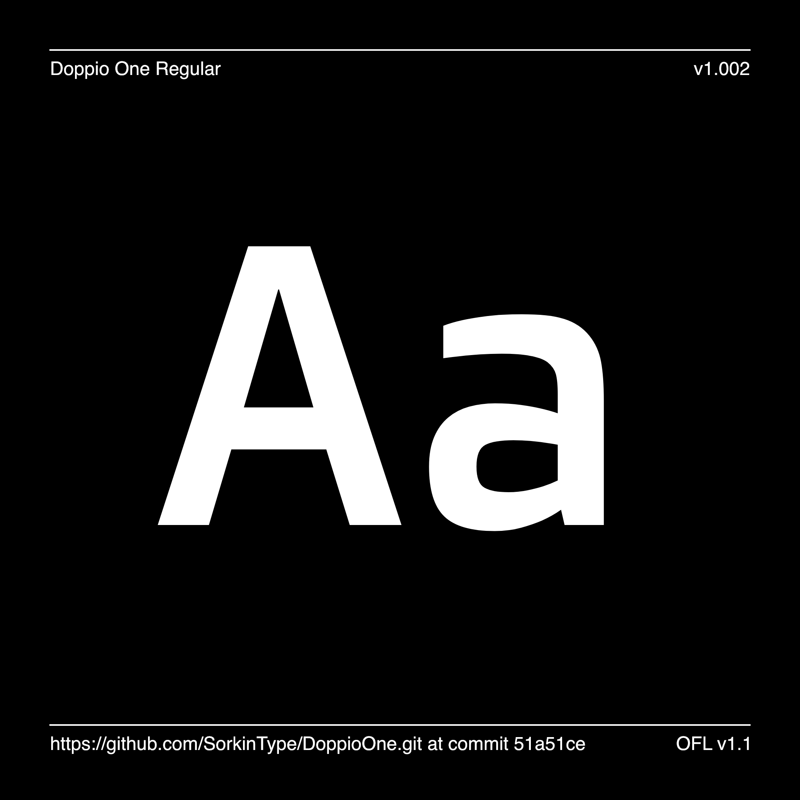

# Doppio One

[![][Fontbakery]](https://SorkinType.github.io/DoppioOne/fontbakery/fontbakery-report.html)
[![][Universal]](https://SorkinType.github.io/DoppioOne/fontbakery/fontbakery-report.html)
[![][GF Profile]](https://SorkinType.github.io/DoppioOne/fontbakery/fontbakery-report.html)
[![][Outline Correctness]](https://SorkinType.github.io/DoppioOne/fontbakery/fontbakery-report.html)
[![][Shaping]](https://SorkinType.github.io/DoppioOne/fontbakery/fontbakery-report.html)

[Fontbakery]: https://img.shields.io/endpoint?url=https%3A%2F%2Fraw.githubusercontent.com%2FSorkinType%2FDoppioOne%2Fgh-pages%2Fbadges%2Foverall.json
[GF Profile]: https://img.shields.io/endpoint?url=https%3A%2F%2Fraw.githubusercontent.com%2FSorkinType%2FDoppioOne%2Fgh-pages%2Fbadges%2FGoogleFonts.json
[Outline Correctness]: https://img.shields.io/endpoint?url=https%3A%2F%2Fraw.githubusercontent.com%2FSorkinType%2FDoppioOne%2Fgh-pages%2Fbadges%2FOutlineCorrectnessChecks.json
[Shaping]: https://img.shields.io/endpoint?url=https%3A%2F%2Fraw.githubusercontent.com%2FSorkinType%2FDoppioOne%2Fgh-pages%2Fbadges%2FShapingChecks.json
[Universal]: https://img.shields.io/endpoint?url=https%3A%2F%2Fraw.githubusercontent.com%2FSorkinType%2FDoppioOne%2Fgh-pages%2Fbadges%2FUniversal.json

Doppio One is a robust low contrast sans serif type with a contemporary feeling. Doppio One will work from small text sizes through large display sizes. Doppio's boxy style makes it especially suitable for screen use.

## About

Szymon Celej designs typefaces.

Eben Sorkin designs and art directs typefaces. He works with Sorkin Type Co. and Darden Studio

## Building

Fonts are built automatically by GitHub Actions - take a look in the "Actions" tab for the latest build.

If you want to build fonts manually on your own computer:

* `make build` will produce font files.
* `make test` will run [FontBakery](https://github.com/googlefonts/fontbakery)'s quality assurance tests.
* `make proof` will generate HTML proof files.

The proof files and QA tests are also available automatically via GitHub Actions - look at https://SorkinType.github.io/DoppioOne.

## Changelog

When you update your font (new version or new release), please report all notable changes here, with a date.
[Font Versioning](https://github.com/googlefonts/gf-docs/tree/main/Spec#font-versioning) is based on semver. 
Changelog example:

**11 May 2022. Version 1.002**
- MAJOR Font turned to a variable font.
- SIGNIFICANT New Language Support sets added.

## License

This Font Software is licensed under the SIL Open Font License, Version 1.1.
This license is available with a FAQ at
https://scripts.sil.org/OFL

## Repository Layout

This font repository structure is inspired by [Unified Font Repository v0.3](https://github.com/unified-font-repository/Unified-Font-Repository), modified for the Google Fonts workflow.
